# Cat Shelter

The Cat Shelter website is a simple website with links to different parts of the home page. The purpose of the website is to raise awareness of the cat shelter, to raise funds for the cat shelter and to make it easy for people to adopt cats from the cat shelter.

Users of this website will be able to read about the cat shelter, learn about the cats available for adoption and donate money.

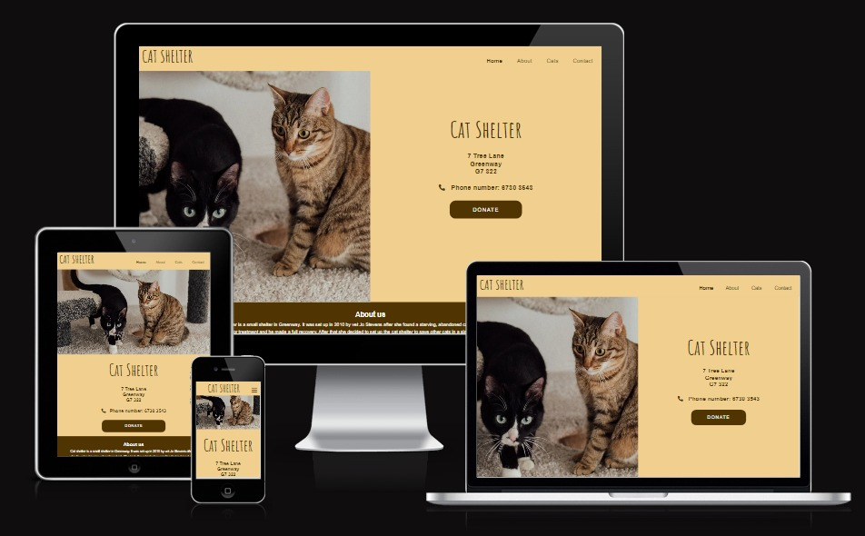

## Features

### Navigation bar

The navigation bar helps users navigate around the webpage. For mobile phones the menu is displayed when the menu toggle button is pressed.

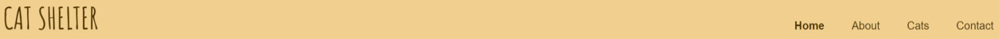

### Main section

The main section shows users what the site is about with the title and the picture. It also shows the address, phone number and donate button. These are all very important for an animal shelter, that's why they're in the main section.

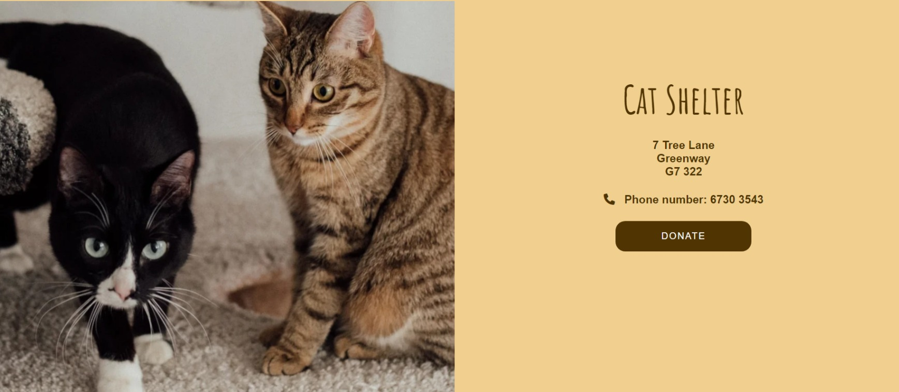

### About section

The about section gives the background story of the shelter, it also contains a picture. This helps build trust and support.

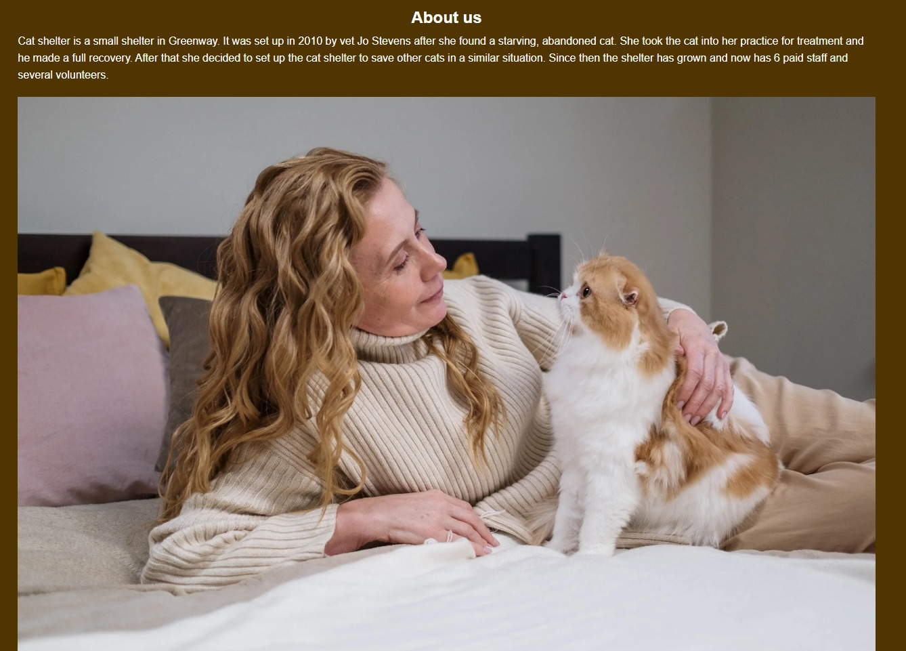

### Section about the cats

This section shows users what cats are available for adoption. It also gives a description of the cats to help users make a decision.

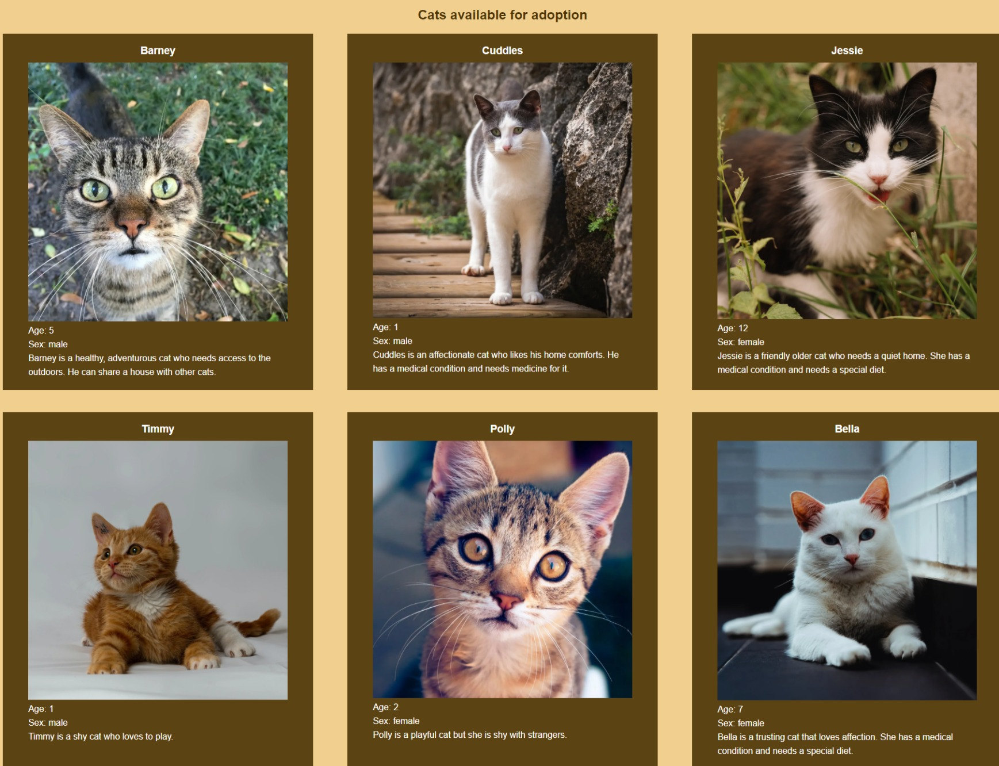

### Contact form

This gives users an easy way to contact the animal shelter.

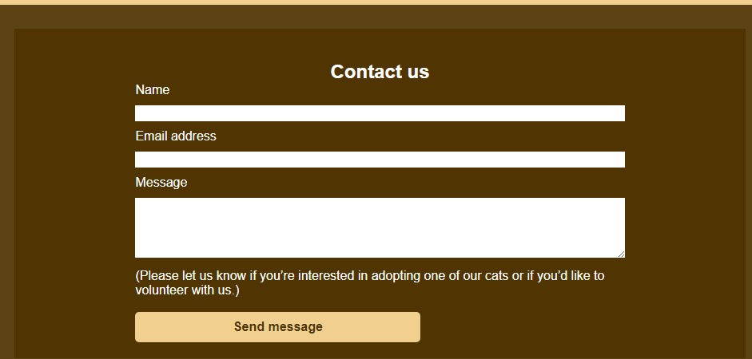

### Donate section

This section gives users the information they need to donate money to the cat shelter online.

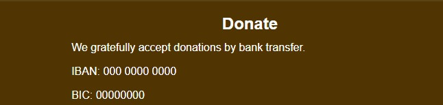

## Testing

My website was tested with the following tools:

- various browsers: Google Chrome, Microsoft Edge, Safari and Firefox 

- [title](https://validator.w3.org/)
  
The first test showed a few errors, I corrected these and then did another test that had no errors.)

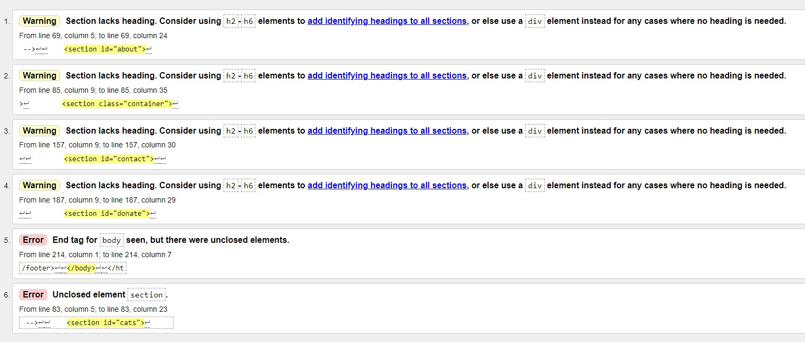

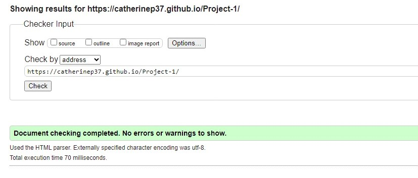

- [title](https://jigsaw.w3.org/css-validator/validator)

This test showed no errors.

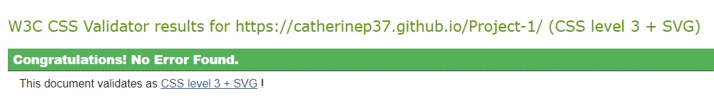

- [title](https://ui.dev/amiresponsive)

- Lighthouse in Google devtools.

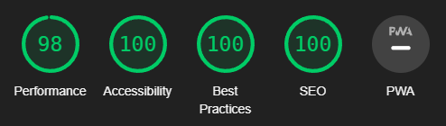

## Bugs

For the wider desktop computer media query I copied and pasted the media query for narrow desktop computers while forgetting to update the width. This led to lots of problems with the layout but when I fixed it all of those problems were resolved.

The donate button wasn't responsive because the left and right padding was in pixels. I solved this by adding a percentage left and right padding.

The fixed header had to be removed for larger screens as it was covering part of the grid below it and that didn't work with the design. It did work with mobile as there was a picture below it that could be partially covered without messing up the design.

## Deployment

To deploy the site, I followed the instructions from the Love Running project.

I went to the setting tab of my GitHub repo and selected pages.

I made sure that the source was set to 'Deploy from Branch', the main branch was selected and the folter was set to / (root). Then I clicked save and waited for
the build to finish. Finally I clicked on 'github-pages'.

Here is the deployed site:

[title](https://catherinep37.github.io/Project-1/)

## Credits

### Images:

Photo by Arina Krasnikova: [title](https: //www.pexels.com/photo/adorable-cats-on-the-floor-carpet-7725961/)

Photo by cottonbro studio: [title](https://www.pexels.com/photo/woman-in-sweater-holding-orange-and-white-cat-6865039/)

Photo by Ellie Burgin: [title](https://www.pexels.com/photo/cute-cat-on-grassy-ground-4612722/)

Photo by Nikolett Emmert: [title](https://www.pexels.com/photo/cute-tabby-cat-14440674/)

Photo by Jan Laugesen: [title](<https://www.pexels.com/photo/kitten-sitting-on-white-floor-12573568/)

Photo by Willy Ams: [title](https://www.pexels.com/photo/close-up-photo-of-white-cat-4056753/)

Photo by Renee Bigelow: [title](https://www.pexels.com/photo/macro-photo-of-brown-tabby-cat-51439/)

Photo by Dorte: [title](https://www.pexels.com/photo/white-and-grey-short-fur-cat-beside-grey-rock-during-daytime-179237/)

### Navigation toggle menu

The navigation toggle menu was inspired by the navigation menu from the Code Institute Love Running project.
